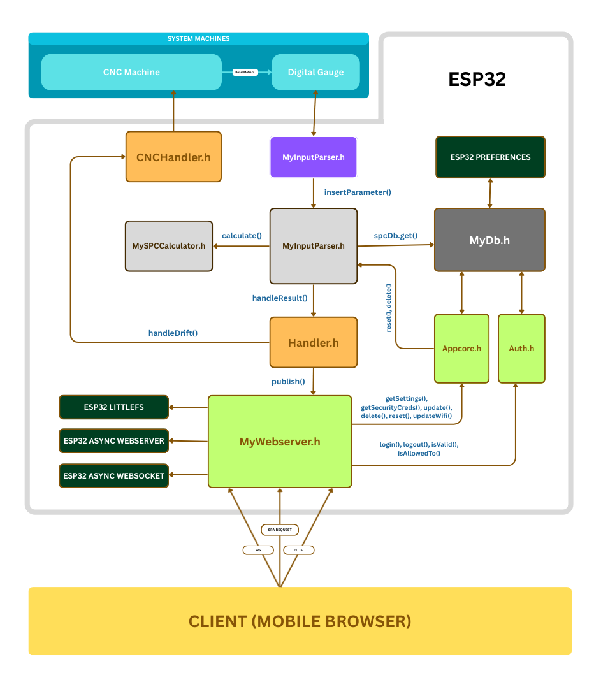

# ESP32 Based File System Argument Passing to SPC Calculation

## Table of Contents
1. [Introduction](#1-introduction)  
   1.1 [Problem Statement](#11-problem-statement)  
   1.2 [Solution Achieved Through This Project](#12-solution-achieved-through-this-project)  

2. [Methodology](#2-methodology)  
   2.1 [Tech Stack](#21-tech-stack)  
   2.2 [Flow Diagram](#22-flow-diagram)  

3. [How To Use](#3-how-to-use)  
   3.1 [Direct Through Runnable](#31-direct-through-runnable)  
   3.2 [Recompile and Custom Upload](#32-recompile-and-custom-upload)  

4. [Snapshots](#4-snapshots)  

---

## 1. Introduction

### 1.1 Problem Statement  

CNC (**Computer Numerical Control**) machines are widely used in modern foundries to manufacture precise mechanical parts.  
To maintain consistent quality, these machines require **Statistical Process Control (SPC)** calculations, which analyze real-time measurement data from gauges and identify process variations or drifts.  

At **Zanavr Group of Technology**, SPC monitoring is currently implemented using a **separate PC connected to each CNC machine**. The PC reads input from gauges, performs SPC calculations, and displays the results to operators.  

While functional, this approach suffers from major drawbacks:  

- **High hardware dependency**: Every CNC machine requires a dedicated PC, increasing cost and maintenance efforts.  
- **Manual intervention**: Operators must frequently configure and monitor SPC settings, reducing efficiency.  
- **Lack of centralized control**: SPC preferences, user management, and event handling cannot be easily managed across machines.  

This results in a system that is **expensive, inefficient, and not scalable**, highlighting the need for a more streamlined and automated solution.  

---

### 1.2 Solution Achieved Through This Project  

To overcome the inefficiencies of the existing SPC monitoring setup, a **smart ESP32-based solution** has been developed. Instead of relying on a dedicated PC for each CNC machine, the ESP32 microcontroller is used as a lightweight, cost-effective, and centralized processing unit.  

**Key features of the proposed solution include:**  

- **Direct gauge data acquisition**: The ESP32 reads real-time measurement data directly from gauges attached to CNC machines.  
- **Automated SPC calculations**: The device fetches SPC rules and parameters from a user-defined database and applies them automatically to detect drifts or variations.  
- **Event handling and alerts**: When a drift is detected, the ESP32 triggers events that notify the CNC system and operators immediately.  
- **Self-hosted web interface**: A built-in web server hosted on the ESP32 allows operators to:  
  - Dynamically configure SPC settings  
  - Update Wi-Fi credentials  
  - Manage users and roles for secure access control  
- **Cost-effectiveness and scalability**: By replacing PCs with ESP32 modules, the overall system becomes more economical, easier to maintain, and scalable across multiple CNC machines.  

This solution transforms SPC monitoring from a **manual, PC-dependent workflow** into an **automated, configurable, and IoT-enabled system**, improving efficiency, reducing costs, and enabling centralized control.  

---

## 2. Methodology

### 2.1 Tech Stack  

- **ESP32 Development Board** – ESP32 DevKit V1 (ESP32-WROOM-32 family), selected for its dual-core processing power, built-in Wi-Fi
- **File System & Storage** – LittleFS for file handling, Preferences API for persistent key-value storage.  
- **Networking & Communication** – AsyncWebServer and AsyncWebSocket libraries for serving a self-hosted web interface and enabling real-time communication.  
- **Programming Language** – C++ for firmware development on the ESP32.  
- **Frontend** – React.js for building the interactive and responsive website.  

### 2.2 Flow Diagram  
  

The following components define the core architecture of the system:  

1. **MyDb.h** – [(View Detailed Documentation)](./docs/MyDb.md)  
   Built on top of **ESP32 Preferences** (a key-value database based on NVS storage).  
   It provides extended features such as:  
   - Persistent storage for complex data structures  
   - Easy operations like `get`, `set`, `delete`, `has`, and `getKeys`  
   This enables reliable and efficient data handling across system restarts.  

2. **MyWebserver.h** – [(View Detailed Documentation)](./docs/MyWebserver.md)  
   Based on **AsyncWebServer** and **AsyncWebSocket**, this module:  
   - Serves the **SPA (Single Page Application)** frontend  
   - Listens for HTTP and WebSocket requests  
   - Integrates with **Auth.h** and **AppCore.h** for secure and structured request processing  
   - Exposes key endpoints:  
     `login`, `logout`, `update`, `updateRole`, `updateWifi`, `getSettings`,  
     `getSecurityCredentials`, `delete`, `reset`, `deleteRole`  
   - Supports WebSocket subscriptions to enable a **pub-sub communication model**  

3. **Auth.h** – [(View Detailed Documentation)](./docs/Auth.md)  
   Implements core logic for **user authentication and access control**:  
   - Provides methods such as `login`, `logout`, `isValid`, `isAllowedTo`  
   - Interacts with **MyDb.h** for persistent credential management  
   - Ensures secure and role-based access to system resources  

4. **AppCore.h** – [(View Detailed Documentation)](./docs/AppCore.md)  
   Encapsulates the **business logic** required to process client requests:  
   - Handles complex request flows for both HTTP and WebSocket interactions  
   - Provides functions like `update`, `updateWifi`, `getSettings`,  
     `getSecurityCredentials`, `delete`, and `reset`  
   - Acts as the bridge between low-level system operations and higher-level application logic 
6. **MyInputparser.h** – [(View Detailed Documentation)](./docs/MyInputparser.md)  
6. **MySPCCalculator.h** – [(View Detailed Documentation)](./docs/MySPCCalculator.md)  
7. **MySPCHandler.h** – [(View Detailed Documentation)](./docs/MySPCHandler.md)  
8. **MyHandler.h** – [(View Detailed Documentation)](./docs/MyHandler.md)  
9. **CNCHandler.h** – [(View Detailed Documentation)](./docs/CNCHandler.md) 
10. **Frontend** – [(View Detailed Documentation)](./docs/frontend.md) 

---

## 3. How To Use

### 3.1 Direct Through Runnable
(Steps to directly use precompiled binaries.)

### 3.2 Recompile and Custom Upload
(Steps to clone, modify, and upload the project code to ESP32.)

---

## 4. Snapshots

---
